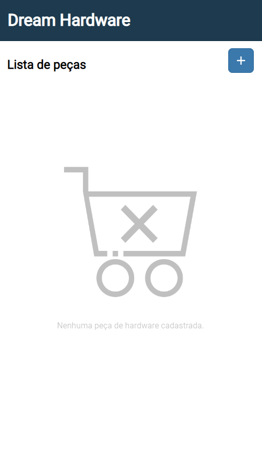

# Dream Hardware - Lucas Lemos Pinheiro

Dream Hardware é minha primeira aplicação web progressiva. Esta aplicação serve para os entusiastas de hardware e PCs montarem uma "lista de desejo" com as peças que pretendem comprar, bem como seu preço. Ela disponibiliza a quantidade de peças catalogadas e também o total daquele orçamento do usuário.

## Telas
Esta aplicação é composta de três telas.
### Tela inicial

A primeira delas é a tela de pesquisa ou inicial, que pode ter dois comportamentos.

Respectivamente, conforme imagens abaixo, o primeiro comportamento é de uma lista vazia, sem peças de hardware cadastrada. O segundo comportamento é com peças cadastradas, onde é disponibilizada uma barra de busca, especialmente útil caso o usuário possua uma lista de peças muito grande.

### Tela de cadastro

A tela de cadastro, conforme abaixo, é onde o usuário pode incluir uma nova peça para sua lista de hardware/orçamento. Ele pode incluir a descrição da peça, tendo uma orientação quanto a uma nomenclatura, e também o seu valor.

### Tela de edição

Por fim, a aplicação possui uma tela de edição, onde o usuário pode editar os detalhes anteriormente cadastrados na tela de cadastro, e pode também excluir aquele registro.

## Dados armazenados

Esta aplicação tem o foco em armazenar peças de hardware, como placas de vídeo, SSDs, HDs, CPUs (processadores), coolers etc.. Para aqueles que sonham em montar um PC gamer, pode ser o ponto de partida manter e controlar um orçamento com essas peças de computador.

## Respostas às perguntas

- A aplicação é original e não uma cópia da aplicação de um colega ou de uma aplicação já existente?
  >É uma aplicação original. Foi utilizada apenas a base ensinada pelo professor ao decorrer das aulas, mas a ideia é original e não foi consultada nenhuma outra aplicação para construi-la.
- A aplicação tem pelo menos duas interfaces (telas ou páginas) independentes?
  >Sim, a aplicação possui três telas/páginas.
- A aplicação armazena e usa de forma relevante dados complexos (mais de um atributo)?
  >Sim, a aplicação armazena uma string e valor numérico. Este valor numérico é convertido depois para float para permitir soma e casas decimais.
- A aplicação possui um manifesto para instalação no dispositivo do usuário?
  >Sim, a aplicação possui um manifesto disponível, conforme ensinado nas aulas.
- A aplicação possui um service worker que permite o funcionamento off-line?
  >Sim, a aplicação possui um service worker disponível, conforme ensinado nas aulas.
  
- O código da minha aplicação possui comentários explicando cada operação?
  >Sim, o código está satisfatoriamente comentado.
- A aplicação está funcionando corretamente?
  >Sim, a aplicação funciona conforme esperado.
- A aplicação está completa?
  >Sim, a aplicação está completa e performa as ações que foram pensadas para ela, baseado principalmente no que foi ensinado nas aulas gravadas.